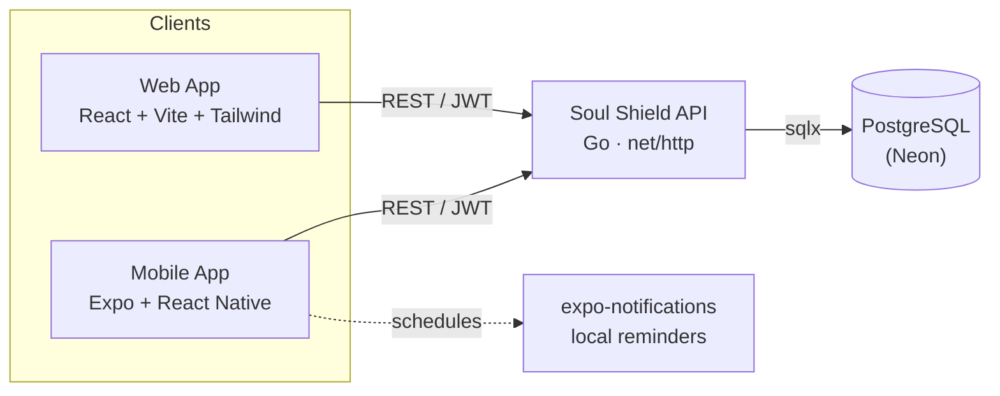
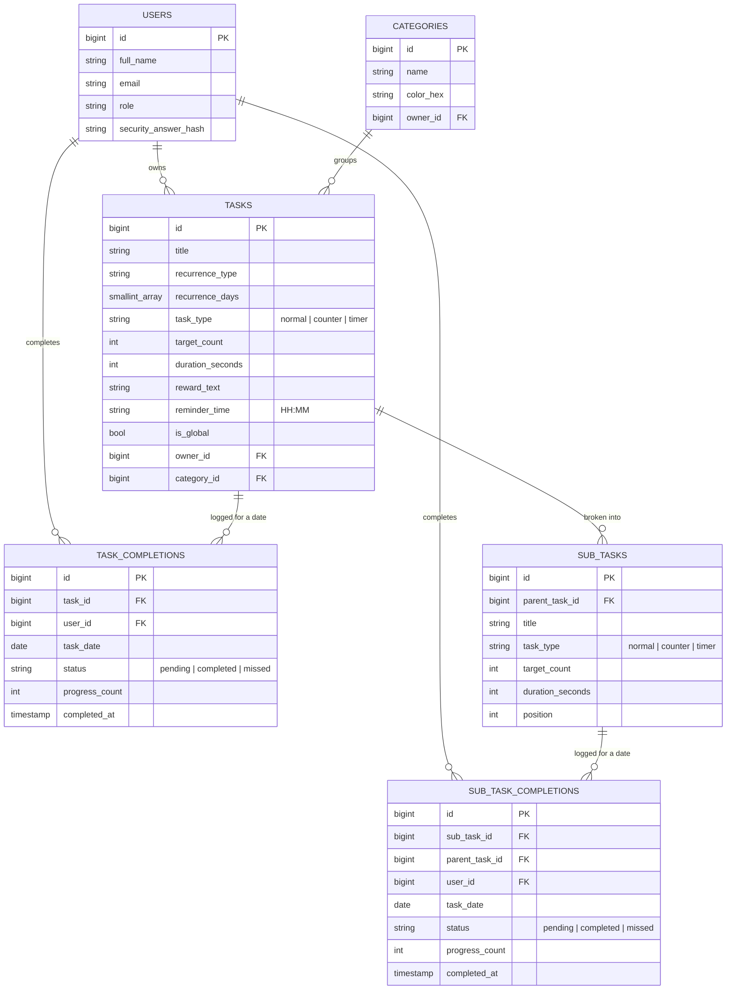

<div align="center">

# 🛡️ Soul Shield

**Your Daily Steps Towards Jannah**

A full-stack habit & task tracker for building consistent daily worship and self-improvement routines — with a Go REST API, a React web dashboard, and a native Expo mobile app that reminds you before you forget.

[](soul-shield)
[](soul-shield-client)
[](soul-shield-mobile-app)
[](#-database)
[](#-license)

</div>

---

## 🔗 Live Demo

| | Link |
|---|---|
| 📑 API / Swagger Docs | [https://soul-shield-api.onrender.com/swagger/index.html](https://soul-shield-api.onrender.com/swagger/index.html) |
| 🌐 Website | *Not deployed yet* |
| 🤖 Android App (APK) | *Not published yet* |

## 📖 Overview

Soul Shield helps you build and keep daily routines — dhikr, prayers, reading, or any recurring habit — by tracking completion, celebrating streaks with custom reward messages, and nudging you with a notification if you forget. One backend, two clients:

- **Web dashboard** (`soul-shield-client`) — fast, animated, desktop-friendly task management.
- **Mobile app** (`soul-shield-mobile-app`) — the daily-driver experience, with local push reminders and offline support.
- **API** (`soul-shield`) — a single Go service both clients talk to.

## ✨ Features

**Task tracking**
- 🔁 Flexible recurrence — daily, weekly, or custom day-of-week schedules
- ✅ Three task types: simple **checkbox** tasks, tally-style **counter** tasks (e.g. "recite 100x"), and duration-based **timer** tasks (e.g. "study 30 minutes")
- ⏱️ **Timer tasks** — start/pause/resume a countdown that auto-completes the task at zero, with a running notification and a completion notification even while backgrounded; a **manual Complete button** lets you finish the task immediately (e.g. you did the work but forgot to start the timer) without waiting out the remaining duration — both paths converge on the same completion, reward, and offline-sync logic, so there's no double-completion risk if both happen near-simultaneously
- 🎯 A standalone **Focus Timer** (Profile → Tools → Timer) — a general-purpose countdown not tied to any task, with an animated fill visual and optional vibration on completion
- 🧩 **Sub-tasks** — break any task into an unlimited list of smaller Normal, Counter, or Timer sub-tasks, added inline via a "Do you want to add sub-tasks?" toggle in the task form. Once a task has sub-tasks:
  - it can no longer be checked off directly — its status (`pending` → `partially_completed` → `completed`) is derived from how many sub-tasks are done that day;
  - its reward only fires once every sub-task is complete, not per sub-task;
  - sub-tasks share the parent's recurrence and have no reminder of their own.
- 🎁 Custom reward messages that surface the moment a task is completed
- 🗂️ User-defined categories with color coding
- 📌 Admin-managed **fixed tasks** that appear for every user
- ⏰ Per-task **reminder notifications** on mobile — set a time, get nudged if you forget
- 📊 History view with a completion heatmap over any date range
- 🔒 Past/future days are read-only in both clients — only *today's* tasks can actually be completed, so progress can't be back- or forward-dated

**Accounts & security**
- 🔐 JWT-based authentication
- 🔑 Security-question password reset flow (no email OTP round-trip)
- 👤 Role-based access (`user` / `admin`)

**Client experience**
- 📱 Offline-first mobile app — optimistic updates, queued mutations, auto-replay when back online
- ⚡ Local-first startup — the app opens instantly from the on-device cache (persisted TanStack Query cache + cached profile) instead of blocking on the API, so a slow/cold backend never delays getting into the app; fresh data syncs in the background once a connection is available
- 🔔 In-app sync-failure notifications so a failed background request is never silent
- 🌓 Light/dark theme support
- 🎨 Smooth, animated UI on both web (Framer Motion) and mobile (Reanimated)

## 🏗️ Architecture



## 🧰 Tech Stack

| | Backend (`soul-shield`) | Web (`soul-shield-client`) | Mobile (`soul-shield-mobile-app`) |
|---|---|---|---|
| Language | Go 1.25 | JavaScript (React 19) | TypeScript (React Native 0.81) |
| Framework | `net/http` + `ServeMux` | Vite 8 | Expo SDK 54 + Expo Router |
| Data | PostgreSQL (Neon) via `sqlx` + `pgx` | — | TanStack Query (persisted cache) |
| Auth | `golang-jwt` | JWT stored client-side | `expo-secure-store` |
| Styling | — | Tailwind CSS 4 | `StyleSheet` + themed components |
| Motion | — | Framer Motion | React Native Reanimated |
| Migrations | `sql-migrate` | — | — |
| Docs | Swagger / OpenAPI (`swaggo`) | — | — |
| Notifications | — | — | `expo-notifications` (local scheduling) |

## 📂 Monorepo Structure

```
Soul_Shield/
├── soul-shield/                 # Go REST API
│   ├── cmd/                     # entrypoint / server bootstrap
│   ├── config/                  # env-driven configuration
│   ├── infra/db/                # DB connection + migration runner
│   ├── migrations/              # sql-migrate up/down scripts
│   ├── repo/                    # data access layer
│   ├── rest/handlers/           # HTTP handlers, grouped by domain
│   │   ├── user/  task/  category/  opt/
│   ├── rest/middlewares/        # JWT auth, CORS, logging, role guards
│   ├── util/                    # shared errors & constants
│   └── docs/                    # generated Swagger spec
│
├── soul-shield-client/          # React web dashboard
│   └── src/
│       ├── pages/               # Dashboard, History, Categories, Admin, Auth
│       ├── components/          # TaskCard, CounterWidget, RewardModal, ...
│       ├── context/              # Auth + API providers
│       └── hooks/                # data-fetching hooks
│
└── soul-shield-mobile-app/      # Expo React Native app
    ├── app/                      # file-based routes (expo-router)
    │   ├── (auth)/               # login, register, reset password
    │   ├── (tabs)/                # home, history, categories, profile, admin
    │   └── task/ category/       # create/edit modals
    ├── components/                # TaskCard, RewardModal, CounterControls, ...
    ├── hooks/queries/              # TanStack Query hooks per resource
    └── lib/                        # notifications, date, network, storage helpers
```

## 🔌 API Reference

Full interactive docs are served at **`/swagger/index.html`** once the backend is running. Summary:

| Method | Endpoint | Description |
|---|---|---|
| `POST` | `/users/register` | Create an account (with security question) |
| `POST` | `/users/login` | Authenticate, receive a JWT |
| `POST` | `/users/verify-security-answer` | Step 1 of password reset |
| `POST` | `/users/reset-password` | Step 2 of password reset |
| `GET` | `/users/me` | Current authenticated user |
| `POST` | `/tasks` | Create a task, optionally with `sub_tasks` |
| `GET` | `/tasks?date=` | List tasks + status for a given day |
| `GET` | `/tasks/history?from=&to=` | List tasks + status across a date range |
| `PATCH` | `/tasks/{id}` | Update a task; `sub_tasks` replaces the sub-task list if provided |
| `DELETE` | `/tasks/{id}` | Delete a task (cascades its sub-tasks) |
| `POST` | `/tasks/{id}/complete` | Toggle a normal or timer task complete for a date (timer client auto-calls this at 00:00, or the user calls it manually) |
| `POST` | `/tasks/{id}/increment` | Add progress to a counter task |
| `POST` | `/tasks/{taskId}/subtasks/{subTaskId}/complete` | Complete a normal or timer sub-task |
| `POST` | `/tasks/{taskId}/subtasks/{subTaskId}/increment` | Add progress to a counter sub-task |
| `POST` | `/categories` | Create a category |
| `GET` | `/categories` | List categories |
| `PATCH` | `/categories/{id}` | Update a category |
| `DELETE` | `/categories/{id}` | Delete a category |

All routes except registration/login/password-reset require `Authorization: JWT <token>`.

## 🗄️ Database



The parent task's own status (surfaced in API responses, never stored) is a fourth value — `partially_completed` — derived at read time from its sub-tasks' completion state once it has any.

## 🚀 Getting Started

### Prerequisites

- [Go](https://go.dev/) 1.25+
- [Node.js](https://nodejs.org/) 20+
- A PostgreSQL database (e.g. a free [Neon](https://neon.tech/) instance)
- [Expo Go](https://expo.dev/go) app (for quick mobile testing) or Android Studio / Xcode for a native build

### 1. Backend

```bash
cd soul-shield
cp .env.example .env   # fill in the values below
go run main.go
```

<details>
<summary>Required environment variables</summary>

| Variable | Description |
|---|---|
| `VERSION`, `SERVICENAME` | App metadata |
| `HTTPPORT` | Port to listen on |
| `SECRETKEY` | JWT signing secret |
| `CONN_STRING_FOR_DB` | Postgres connection string (used for the actual connection) |
| `DB_HOST`, `DB_PORT`, `DB_NAME`, `DB_USER`, `DB_PASSWORD`, `DB_ENABLE_SSL_MODE` | Validated at startup |
| `SMTP_HOST`, `SMTP_PORT`, `SMTP_EMAIL`, `SMTP_PASSWORD` | Outbound mail (password reset, etc.) |

</details>

Migrations run automatically on startup. Swagger UI: `http://localhost:<HTTPPORT>/swagger/index.html`.

### 2. Web client

```bash
cd soul-shield-client
npm install
npm run dev
```

### 3. Mobile app

```bash
cd soul-shield-mobile-app
npm install
npx expo start
```

Scan the QR code with **Expo Go** to run it instantly. Local reminder notifications schedule correctly in Expo Go — a custom dev build (`npx expo run:android` / `eas build`) is only needed to see the app's own icon on the notification instead of Expo Go's.

## 🗺️ Roadmap

- [ ] iOS/Android production builds via EAS
- [ ] Streaks & long-term progress analytics
- [ ] Shareable progress summaries
- [ ] Push notifications synced across devices (beyond local reminders)

## 📄 License

No license has been published for this project yet — all rights reserved by the author. Reach out if you'd like to use or build on it.

---

<div align="center">

Built with ☕ and ⌨️ by **[Farhan](https://github.com/Farhan0140)**

</div>
